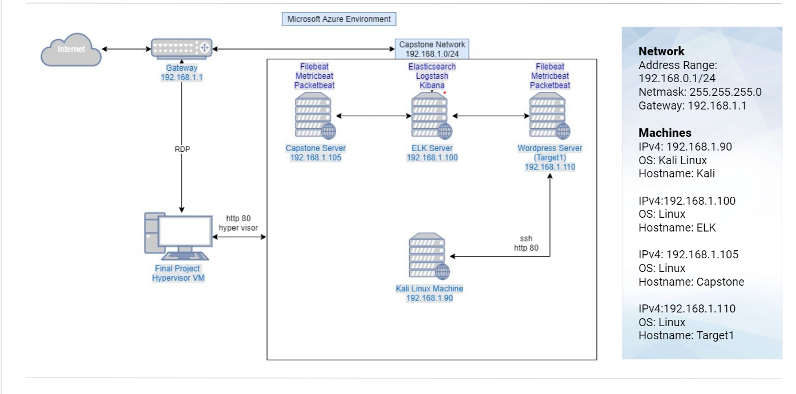

# Final_Engagement
This project demonstartes my knowledge of offensive and defensive security along with my ability to analyze network traffic using wireshark.
## Network Topology

## Offensive Engagement
In this offenesive engagement I will be in a gray box environment exploiting a vulnerable network. The VM's on this netowrk include a vulnerable wordpress VM, and the vulnerable database for the wordpress site.
## Defensive Engagement
The Defensive portion of this project consists of setting up alerts and monitors to monitor the attacks from the Offensive Engagement section of this project.
## Network Analysis
The network analysis section of this project uses wireshark to analysze traffic from a separate network to find vulnerabilities. This network is separate from the Offensive and Defensive Engagement, and does not directly reflect the traffic from them. 